# Lab2: CloudFront log analysis using ELK
[CloudFront access logs](https://docs.aws.amazon.com/AmazonCloudFront/latest/DeveloperGuide/AccessLogs.html) provide rich insights on your customer behavior. The insights gained by analysis of Amazon CloudFront access logs helps improve website availability through bot detection and mitigation, optimizing web content based on the devices and browser used to view your webpages, reducing perceived latency by caching of popular object closer to its viewer, and so on. This results in a significant improvement in the overall perceived experience for the user.

In this lab, you will be building an ELK (ElasticSearch, Logstash and Kibana) stack on AWS to analyze the CloudFront access logs by loading them from Amazon S3 bucket.

[Amazon Elasticsearch Service](https://aws.amazon.com/elasticsearch-service/) (Amazon ES) is a fully managed service that delivers Elasticsearch’s easy-to-use APIs and real-time capabilities along with the availability, scalability, and security required by production workloads. This service offers built-in integrations with [Kibana](https://aws.amazon.com/elasticsearch-service/kibana/), [Logstash](https://aws.amazon.com/elasticsearch-service/logstash/), and AWS services including [Amazon Kinesis Firehose](https://aws.amazon.com/kinesis/firehose/), [AWS Lambda](https://aws.amazon.com/lambda/), and [Amazon CloudWatch](https://aws.amazon.com/cloudwatch/), so that you can build log analysis solutions quickly.

Logstash provides out-of-the box plugins such as [grok](https://www.elastic.co/guide/en/logstash/6.4/plugins-filters-grok.html) for filtering and enriching the data, derives [geo coordinates from Ip addresses](https://www.elastic.co/guide/en/logstash/6.4/plugins-filters-geoip.html) before ingesting the data to ElasticSearch domain.  Kibana provides a broad set of visualization, filtering and aggregation options to analyze your data that is stored in ElasticSearch domain.

In this lab, you will visualize CloudFront access behavior using Kibana Geo-spatial visualization options such as [Regional](https://www.elastic.co/guide/en/kibana/current/regionmap.html) and [Coordinate graphs](https://www.elastic.co/guide/en/kibana/current/tilemap.html). These maps can

Note: We will use a sample access logs generated from our demo environment. In a production scenario, you can just change the Logstash configuration to poll the logs from your S3 bucket or configure CloudFront distribution logs to deliver the bucket used in this Lab.

## High Level Architecture Overview
The solution involves S3 bucket for storing CloudFront access logs, Logstash deployed on EC2, an nginx proxy on EC2 instance and an ElasticSearch domain with built-in Kibana setup. The EC2 instances will be launched in a VPC.  The AWS resources will be provisioned via CloudFormation template.  Amazon ElasticSearch service provides [various options](https://aws.amazon.com/blogs/security/how-to-control-access-to-your-amazon-elasticsearch-service-domain/) such as resource and identity based policies to control access to the domain. In this solution, we will be leveraging IP based policies to restrict the access to the domain to Logstash and proxy servers only.  Access to Kibana [will be controlled](https://docs.aws.amazon.com/elasticsearch-service/latest/developerguide/es-kibana.html#es-kibana-access) via a proxy solution. We will be leveraging a basic http authentication for proxy service to prevent anonymous access.

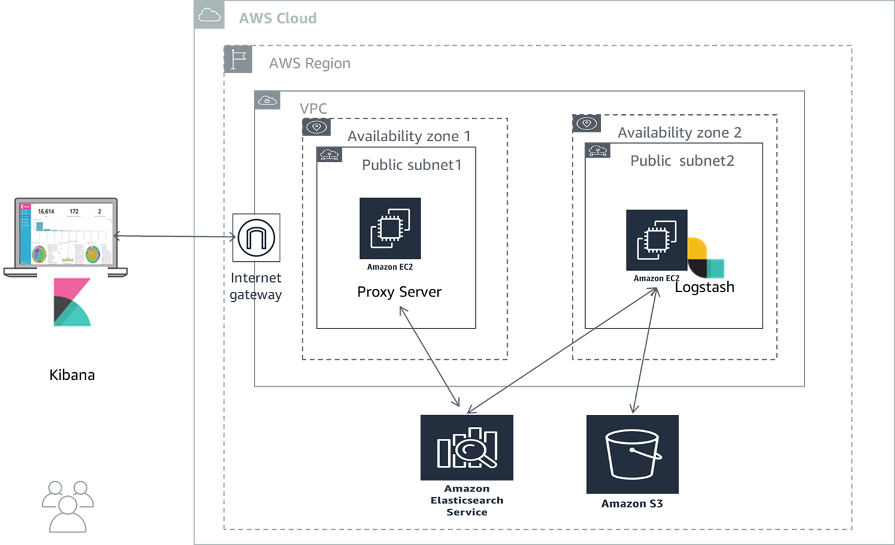
 
## Pre-requisites
This module requires:
 - You should have active AWS account with Administrator IAM role.

## Create a Key Pair for EC2 Instances

In this task, you will need to create a key pair so that we can use this keypair to launch EC2 instances and SSH into it.  The following steps outline creating a unique SSH keypair for you to use in this lab.

1. Sign into the AWS Management Console and open the Amazon EC2 console at [https://console.aws.amazon.com/ec2](https://console.aws.amazon.com/ec2).

2. In the upper-right corner of the AWS Management Console, confirm you are in the desired AWS region i.e. US West (Oregon).

3. Click on **Key Pairs** in the NETWORK & SECURITY section near the bottom of the leftmost menu.  This will display a page to manage your SSH key pairs.


4. To create a new SSH key pair, click the **Create Key Pair** button at the top of the browser window.


5. In the resulting pop up window, type **_[First Name]-[Last Name]-DevCon_** into the **Key Pair Name:** text box and click **Create.**

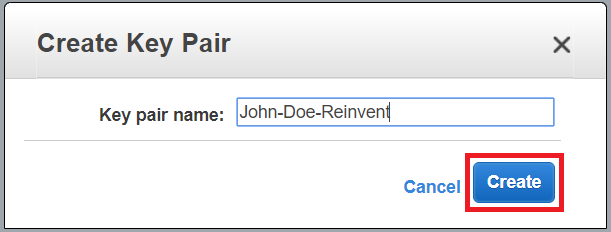

6. The page will download the file **[Your-Name]-DevCon.pem** to the local drive.  Follow the browser instructions to save the file to the default download location.

7. Remember the full path to the file .pem file you just downloaded. You will use this Key Pair to manage your EC2 instances for the rest of the lab.

## Deploy Solution
In this section we will deploy the solution using CloudFormation template. This CloudFormation template will create required resources for this solution including: 

- A VPC with IGW, two public subnets
- Nginx proxy installed on a EC2 instance with an Elastic IP Address
- Logstash installed on a EC2 instance with Elastic IP address
- A S3 bucket in your region which stores a sample CloudFront access logs  
- EC2 IAM role with policies to access the Amazon S3
- Amazon ES domain with 2 nodes with IP-based access policy with access restricted to only Nginx proxy and Logstash instances

The template gives the following outputs:

- Amazon ES domain and Kibana Endpoints.
- Elastic IP details of Logstash and Nginx proxy servers
- Nginx IP URLs for the Amazon ES Kibana through the proxy. You can use this to access the Kibana.

1. Click on **Launch Stack** button below to launch CloudFormation template in US East AWS region.

Region| Launch
------|-----
US East (Ohio) | [](https://console.aws.amazon.com/cloudformation/home?region=us-east-2#/stacks/create/review?stackName=CF-LogAnalysis2018&templateURL=https://s3.amazonaws.com/us-east-1.data-analytics/labcontent/reInvent2018content-ctd410/lab2/templates/CloudFront-Analysis-ELK-Lab.json)
US West (Oregon) | [](https://console.aws.amazon.com/cloudformation/home?region=us-west-2#/stacks/create/review?stackName=CF-LogAnalysis2018&templateURL=https://s3.amazonaws.com/us-east-1.data-analytics/labcontent/reInvent2018content-ctd410/lab2/templates/CloudFront-Analysis-ELK-Lab.json)
EU (Ireland) | [](https://console.aws.amazon.com/cloudformation/home?region=eu-west-1#/stacks/create/review?CF-LogAnalysis2018&templateURL=https://s3.amazonaws.com/us-east-1.data-analytics/labcontent/reInvent2018content-ctd410/lab2/templates/CloudFront-Analysis-ELK-Lab.json)

2. Select the key pair you created in previous section.

3. Update **KibanaPassword** field. Default password is set to **admin123** but we highly recommend to update it to a strong password.

4. Under Create stack, check both checkboxes for **I acknowledge that AWS CloudFormation might create IAM resources with custom names** and click **Create** button.

:warning: **We recommend that you restrict the access to the EC2 instances for your specific IP range in production environments. By default, this setup allows SSH and HTTP access to `0.0.0.0/0`**

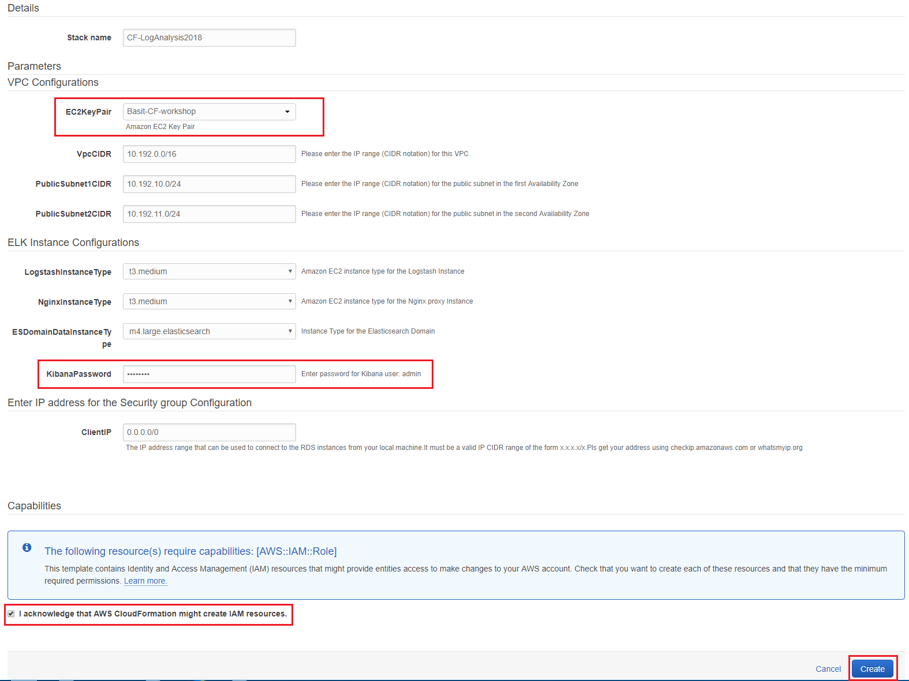

4. You should now see the screen with status **CREATE_IN_PROGRESS**. Click on the **Stacks** link in the top navigation to see current CloudFormation stacks.

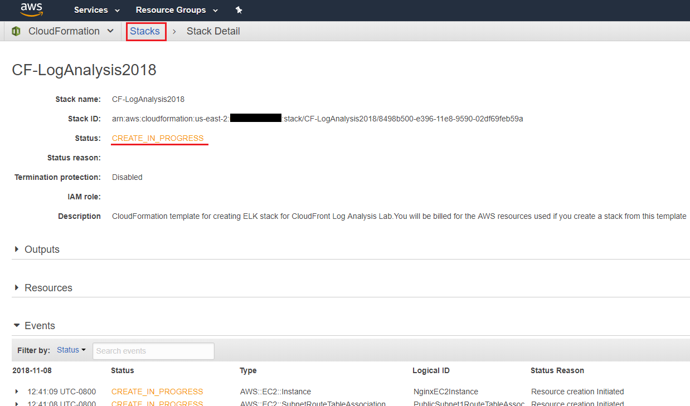

5. Click on the checkbox next to the stack to see additional details below.


6. CloudFormation template will take around 10 minutes to complete. Wait until CloudFormation stack status changes to  **CREATE_COMPLETE**.

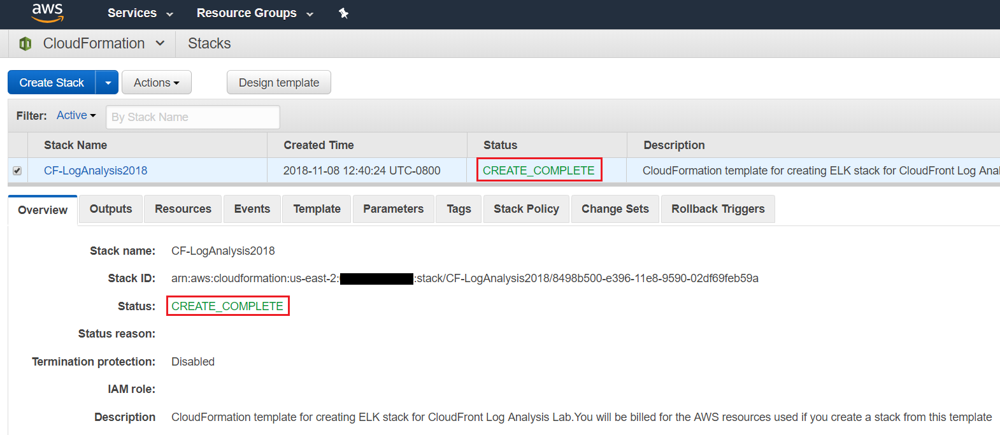

7. Click on "Output" tab and note down the outputs as we will be referring to these values in next steps.


## Verify Amazon Elasticsearch Domain access policy
1. Go to Amazon Elasticsearch(ES) console: https://us-east-2.console.aws.amazon.com/es 

2. Click on the Elasticsearch domain CloudFormation Template has created.


3. Click on the button **Modify access policy**


4. Verify that the Elasticsearch domain access policy has a full access to this ES domain for the IP addresses of Logstash and Nginx proxy servers. You can verify the IP addresses of servers from Cloudformation output values as shown in the screenshot.


## Verify CloudFront  access logs in S3 bucket
As part of this lab, we copy CloudFront access logs in a S3 bucket created by the CloudFormation template. Before continuing with the rest of the lab, you need to make sure those log files are copied to your account. CloudFront access logs are compressed using gzip format. Refer to AWS documentation for [CloudFront access logs](https://docs.aws.amazon.com/AmazonCloudFront/latest/DeveloperGuide/AccessLogs.html) format and details. You can download sample log file to your laptop to inspect the contents.

1. Go to CloudFormation console : http://console.aws.amazon.com/cloudformation/ 

2. Click the checkbox next to the stack you created.

3. Select **Resources** tab and look for **CFLogBucket** and click on the **Physical ID** for it to go to S3 bucket with log files.

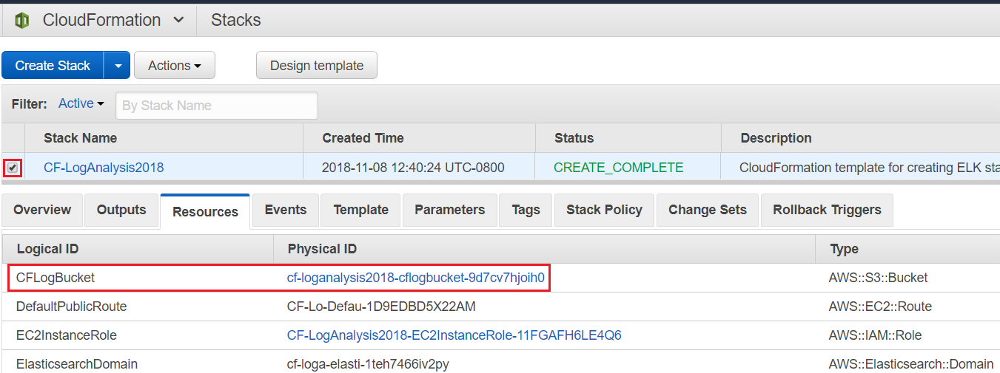

4. You should be able to see ***.gz** files in S3 bucket. This shows that CloudFront access logs were copied to S3 bucket and we can continue with the rest of the lab.

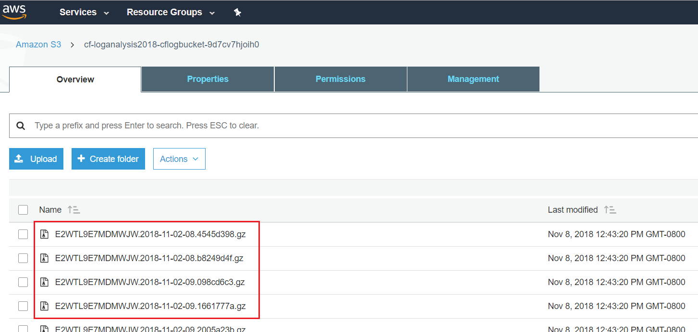

## Logstash ingestion of CloudFront logs
In this step we will configure Logstash agent installed on EC2 instance to ingest CloudFront logs we just verified in S3. Logstash provides built-in transformation and filtering for many log formats using grok filter plugins. In this step, we will also use plugins such as geoip for latitude and longitude and useragent to retrieve the user agent information from the access the logs. 
[Index mapping templates](https://www.elastic.co/guide/en/elasticsearch/reference/current/indices-templates.html) allow you to define templates for mapping the appropriate data types with the fields contained in the logs as part of the index creations. In this lab, we will be creating index templates to map the request IP attribute to IP data type and geoip to map latitude and longitude information for creating geo-point data type. This will ensure right mapping of log fields as part of the index creation.
 
1. Go to [CloudFormation console](http://console.aws.amazon.com/cloudformation/) and copy the IP address for **LogstashEC2Instance** from **Outputs** tab.

2. You need to connect to the Logstash EC2 instance using SSH. Please make sure that you have configured your machine to SSH into EC2 instances. You can follow the [instructions here](https://docs.aws.amazon.com/AWSEC2/latest/UserGuide/AccessingInstances.html) to configure your Mac/Windows machine to connect to EC2 instance using SSH. Use the following command to connect to EC2 instance:
	
	`ssh -i dub.pem ec2-user@<Elastic IP of Logstash server>`

3. Create an Index mapping template for processing the CloudFront logs. CloudFormation template has already copied the **indextemplate.json** in `/home/ec2-user/templates directory` .  Make sure you copy the Elasticsearch domain from CloudFront output key **ESDomainEndpoint**.
	```bash
	sudo su -
	
	curl -XPUT <ES Domain Endpoint>/_template/cloudfront-template -H "Content-Type: application/json" d@/home/ec2-user/templates/indextemplate.json	
	```
4. Run the following commands to configure Logstash to start log ingestion.
	```bash
	# Run following commands to verify that installed Java version is 1.8.x
	
	cd /elk/logstash-6.4.2/bin/
	
	java –version
	```
5. Copy the logstash configuration file **cloudfront.conf** from **/home/ec2-user/templates/** to **/elk/logstash-6.4.2/bin**.
	```bash
	cp /home/ec2-user/templates/cloudfront.conf /elk/logstash-6.4.2/bin/
	```
6. Logstash uses S3 input plugin for polling the logs continuously and write to Elasticsearch domain using **logstash-output-amazon_es**  plugin. Edit  **input -> s3** section in **cloudfront.conf** to update S3 bucket. 
	```nginx
	input{
		s3{
			#Enter S3 bucket name that has the CloudFront access logs. You can copy it from 
			#CloudFormation stack output "CFLogBucket"
			bucket => "<S3 BUCKET CFLogBucket>"
			
			#No change needed for "prefix"
			prefix => ""
			
			#Point "region" to your AWS Region.
			region => "<AWS REGION YOU CREATED YOUR STACK IN>"  
		}
	}
	```
7. Edit  **output-> amazon_es** section to update Elasticsearch domain information for your setup.
:warning: Make sure the Elasticsearch domain is listed **WITHOUT** https:// in the following section.
	```nginx
	output{
		amazon_es{
			#Enter Elasticsearch domain name WITHOUT https://. You can copy the Elasticsearch
			#domain from CloudFormation stach output "ESDomainEndpoint"
			hosts =>["<Elasticsearch Domain>"]
			
			#Point "region" to AWS Region you have created the CloudFormation stack in.
			region => "<AWS REGION YOU CREATED YOUR STACK IN>"
		}
	}
	```
8. Start Logstash process
	```bash
	cd /elk/logstash-6.4.2/bin/
	./logstash –f cloudfront.conf
	
	```
9. Check if its Logstash process started properly with tailing the log file

	```bash
	tail –f /elk/logstash-6.4.2/logs/logstash-plain.log
	```

10. Check if the Indexes are created on ES domain. Go to [Elasticsearch AWS Console](http://console.aws.amazon.com/es/). Click on the Elasticsearch domain that is created earlier. 


11. CloudFront logs indices are created on day basis as shown below.


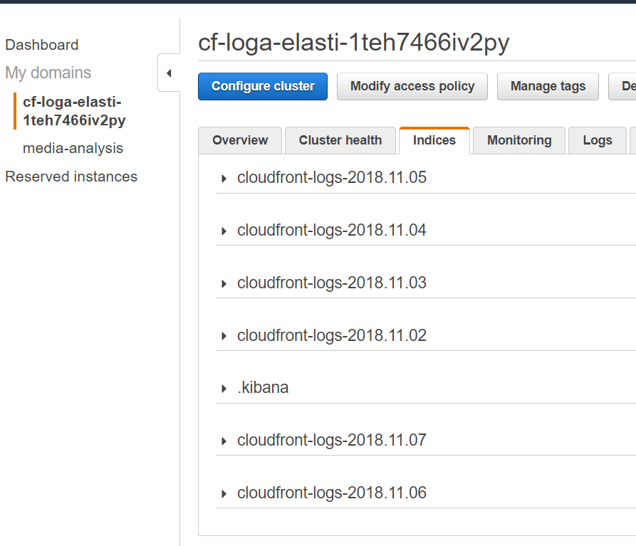

You have successfully configured Logstash. Let us proceed to Nginx configuration.
## Nginx proxy configuration
It should be noted that Kibana does not natively support IAM users and roles, but Amazon Elasticsearch offers several solutions for controlling access to Kibana. For more details, please refer to [AWS documentation](https://docs.aws.amazon.com/elasticsearch-service/latest/developerguide/es-kibana.html#es-kibana-access). In this lab, we will be using open source based Nginx proxy solution to access the Kibana console.

1. Go to [CloudFormation console](http://console.aws.amazon.com/cloudformation/) and copy the IP address for **NginxEC2Instance** from **Outputs** tab.

2. Connect to Nginx proxy EC2 instance as ec2-user using your key pair.
	```bash
	ssh -i dub.pem ec2-user@<Elastic IP of Nginx EC2 server>
	```

3. Copy **lab2-nginx.conf** from **/home/ec2-user/templates/**. You will need to update the conf file with your Elasticsearch domain endpoints, Elasticsearch Kibana endpoint and Elastic IPs.
	```bash
	sudo su -
	cd /etc/nginx
	
	mv nginx.conf nginx.conf-bkup
	
	cp /home/ec2-user/templates/lab2-nginx.conf /etc/nginx/nginx.conf
	```
4. Update following parameters in **nginx.conf** with correct values for Elasticsearch domain endpoint **(ESDomainEndpoint)**, Kibana endpoint **(ESKibanaEndpoint)** and Nginx EC2 IP **(NginxEC2Instance)**. You can get the values from CloudFormation
	```nginx
	location / {
		
		# ES Domain name WITHOUT https://
		proxy_set_header Host <Elasticsearch Domain name WITHOUT https://>; 
		
		#IP of Nginx EC2 Instance
		proxy_set_header X-Real-IP  <NginxEC2Instance>;

		#Elasticsearch Kibana endpoint 
		proxy_pass https://<Elasticsearch Domain name>/_plugin/kibana/;

		#Elasticsearch kibana endpoint and IP of Nginx EC2 Instance
		proxy_redirect https://<Elasticsearch Domain name>/_plugin/kibana/ http://<NginxEC2Instance>; 
		......
		..........
	}
	location ~ (/app/kibana|/app/timelion|/bundles|/es_admin|/plugins|/api|/ui|/elasticsearch) {
		......
		........
		#Elasticsearch Domain endpoint
		proxy_pass https://<Elasticsearch Domain name>; 
	}
	```

5. Restart the nginx server after updating the configurations.

	```bash
	service nginx reload
	```

Nginx configuration is completed. Next step will be to configure Kibana.

## Kibana Configuration
1. Access the Kibana via Nginx proxy IP address.  For protection of your proxy server, we will leverage a basic Http authentication.  You will be challenged with username and password. Enter the username as admin (lowercase) and password as specified in the parameter section of the CloudFormation template. If you have used default values, then the password is admin123.


2. Kibana dashboard will load.


3. Create the index pattern in Kibana. Go to **Management** section in Kibana. Click **Index Patterns**.

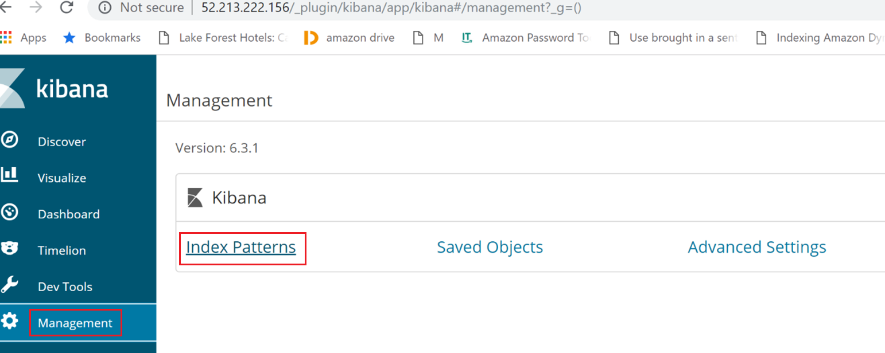

4. Enter **cloudfront*** (lowercase) in Index pattern text box.


5. Click **Next** and choose **@timestamp**  as **Time Filter field name** and click **Create Index pattern** button.

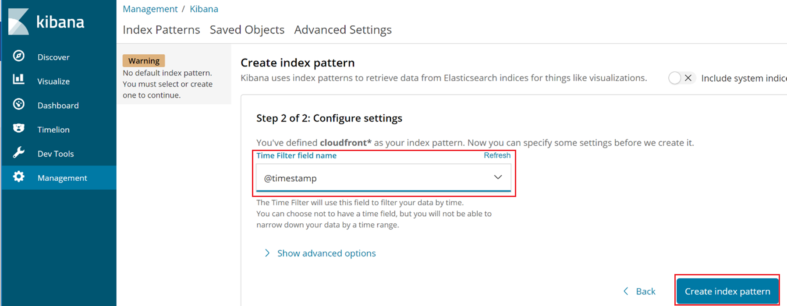

6. You can verify the indexes if it used the correct Index template for mapping . for example, if you browse through the fields, you will see there is a new field named geoip.location which is mapped as geo_point data type.

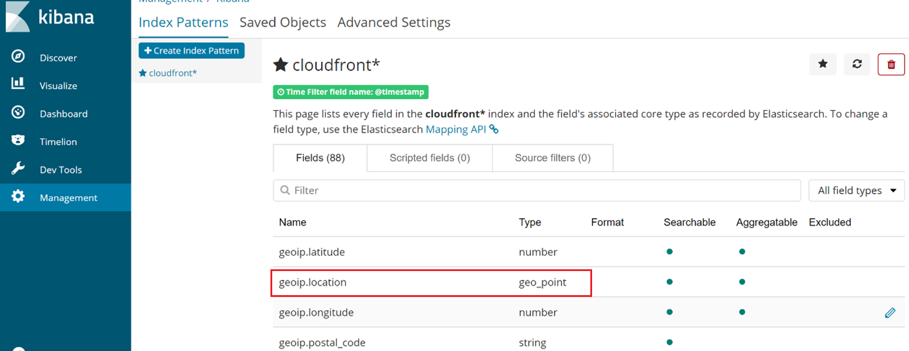

Now Kibana has been configured and let us move to final part of this lab where we will create visualizations.

## Kibana Visualization
Now we are ready to create visualizations. You can create visualizations manually or import the predefined visualizations as JSON templates to your dashboard. We will go over both cases.

### Use Case #1 (User agent Vs Error code)
This visualization will show if customers are experiencing errors and from which  specific device types.

1. Go to Kibana dashboard.

2. Select **Visualize** from the left side menu and click on the **+** in visualize section. 


3.  Select **Heat Map** under **Basic Charts** in **Select visualization type**.

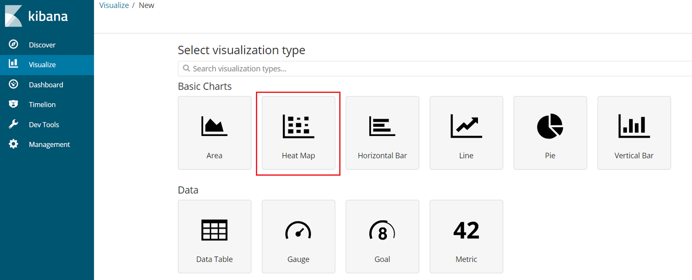

4. Select **cloudfront*** from **From a New Search, Select Index** section.


5. Change the time for visualization from last 15 minutest to **Last 60 days**


6. Select settings under **Bucket** as follows and then click **Apply changes** button (play button on top):

|           | **Aggregation**|**Field**                 |
| ----------|:--------------:| :-----                   |
| **X-Axis**| Terms          | useragent.device.keyword |
| **Y-Axis**| Terms          | sc_status                |


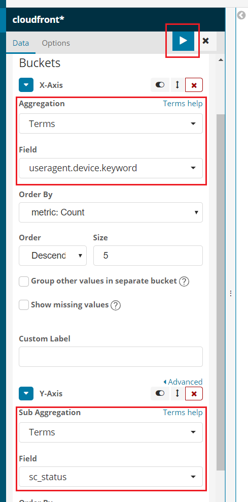

7. You will see the graph/visualization. Save the visualization as **User agent-status-code-heatmap**

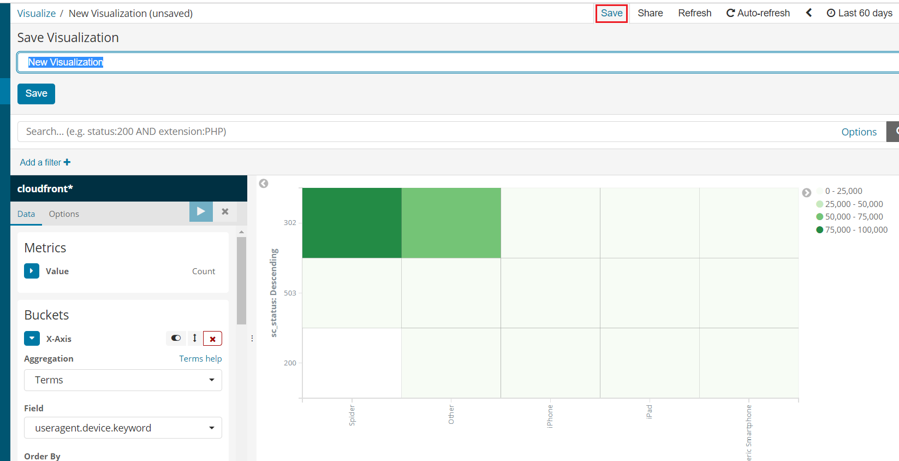

### Use Case #2 (Avg or Max Latency per city)
You can use Geo-spatial visualization using Co-ordinate map. We will show to how to import the visualization from predefined template.

1. Download [kibanamaxlatencypercity.json](https://github.com/aws-samples/amazon-cloudfront-log-analysis/blob/master/lab2-elk-cloudfront-log-analysis/kibanamaxlatencypercity.json) file to your local computer.

2. Go to **Management** -> **Saved objects**.  Click **Import** and import the downloaded **kibanamaxlatencypercity.json**. This visualization shows the max(time_taken) for each city. 


3. Click **Yes, overwrite all objects** if asked for **Automatically overwrite all saved objects** dialog box.

4. Click **Confirm all changes** for **Index Pattern Conflicts** dialog box.

5. You should now see following visualization under the **Visualization** tab.

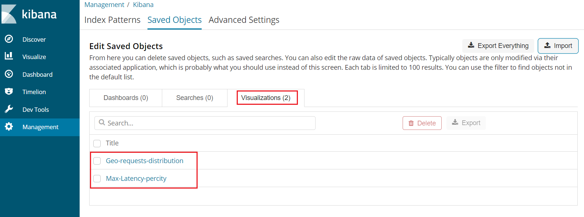

6. Click on **Visualization** from the Kibana dashboard menu and select **Max-Latency-percity** to see the visualization.


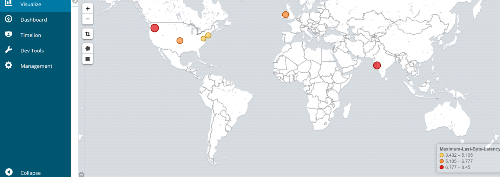

### Use Case #3 (Number of requests per geo-region or popular regions)
In this case, we will create Geo-spatial visualization using regional map. This visualization shows the number of request distribution for each city. This kind of visualization can be used for analyzing the traffic pattern as well as marketing purposes.

1. Download [kibanageorequests.json](https://github.com/aws-samples/amazon-cloudfront-log-analysis/blob/master/lab2-elk-cloudfront-log-analysis/kibanageorequests.json) file to your local computer.

2. Follow **Steps 2 - 6** from the Use Case #2 and import downloaded file (kibanageorequests.json) .

3. Once completed, you will be able to see the final visualization for number of requests per geo-region.


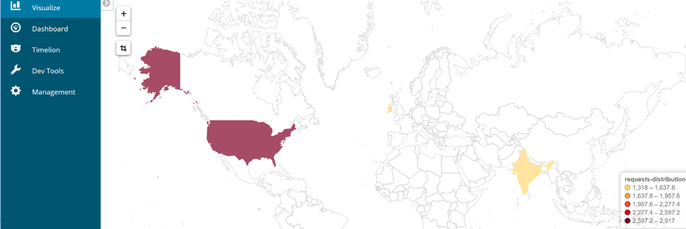   

## Completion
You have successfully this Lab. Please proceed with the clean up of this lab to make sure running resources do not incur unnecessary billing.  

## Clean up
1.  Delete the S3 buckets created in this lab.

2. Go to CloudFormation console : http://console.aws.amazon.com/cloudformation/ 

3. Click the checkbox next to the stack you created.

5. Click **Actions** button and select **Delete Stack** to delete the stack.  

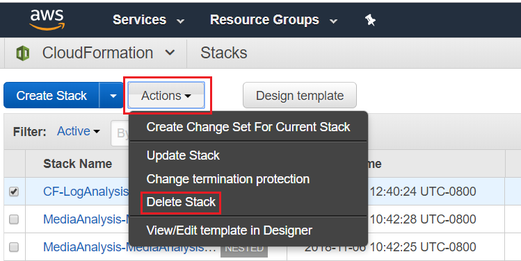   

